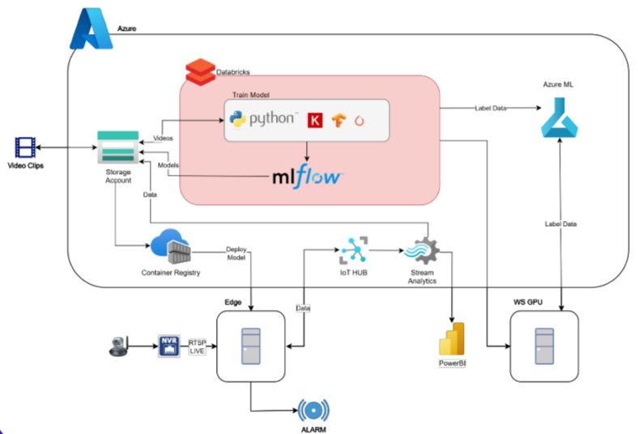

# Computer Vision Risk Detection System (Edge AI)


Sistema de **Visión Artificial en Edge** diseñado para la industria. Monitorea en tiempo real las operaciones en la zona de perforación para identificar maniobras riesgosas, alertar a los operarios mediante alarmas físicas y centralizar la evidencia en la nube para inteligencia de negocios.

---

## 📋 Descripción del Proyecto

Este proyecto implementa una solución híbrida (On-Premise + Cloud) que procesa video RTSP en tiempo real utilizando modelos de **Deep Learning (YOLOv11)** para detección de objetos y estimación de pose humana. 

El sistema opera autónomamente en un servidor industrial (Edge) con aceleración GPU, realizando dos funciones principales:
1.  **Seguridad Táctica (Tiempo Real):** Activa una baliza/sirena en milisegundos al detectar una infracción de seguridad.
2.  **Inteligencia Estratégica (Cloud):** Consolida clips de video y logs, subiéndolos periódicamente a **Azure Blob Storage** para análisis en Power BI.



## ⚠️ Riesgos Detectados

El motor de inferencia (`RiskEngine`) identifica actualmente **8 escenarios de riesgo** basados en lógica geométrica y espacial:

| ID | Riesgo | Descripción |
| :--- | :--- | :--- |
| **R01** | **Extracción Stickout** | Operario con pie dentro del radio de giro de las orejas del Stickout. |
| **R02** | **Cabrón Abierto** | Proximidad peligrosa al Cabrón cuando está operativo/abierto. |
| **R03** | **Pickup Tubular** | Manos posicionadas en el Elevador/Brazotaladro durante el levantamiento. |
| **R04** | **Tubular Pendulando** | Intersección del operario con la trayectoria de un tubular oscilando. |
| **R05** | **Acople Pin-Tubular** | Atrapamiento entre la Llave TM120 y el Stickout durante el acople. |
| **R06** | **Zona Riesgo Pickup** | Ubicación frontal del operario en la línea de fuego del Pickup. |
| **R07** | **Mano en Safata** | Manipulación de la entrada de la Safata durante el acople con Stickout. |
| **R08** | **Mano en Pin-Tubular** | Manos posicionadas en Pin del Tubular mientras está pendulando. |

## 🏗️ Arquitectura Técnica

El sistema se despliega mediante **Docker Compose** orquestando dos microservicios:

1.  **`detection-service`**: 
    * Ejecuta inferencia (YOLOv11 + Pose).
    * Gestiona la conexión RTSP y la Baliza TCP.
    * Graba clips locales con *pre-roll buffer*.
    * *Base:* PyTorch + CUDA 12.1 Runtime.
2.  **`scheduler-service`**: 
    * Ejecuta el proceso ETL (Extract, Transform, Load).
    * Fusiona clips de video fragmentados.
    * Sube evidencia a Azure Blob Storage y limpia el disco local.
    * *Base:* Python Slim.

## 🚀 Instalación y Despliegue

### Prerrequisitos
* **SO:** Windows IoT.
* **Hardware:** GPU NVIDIA (Soporte CUDA 12.x).
* **Software:**
    * [Docker Engine](https://docs.docker.com/engine/install/) & Docker Compose.
    * [NVIDIA Container Toolkit](https://docs.nvidia.com/datacenter/cloud-native/container-toolkit/install-guide.html) (Crítico para acceso a GPU).

### Paso 1: Clonar Repositorio
```bash
git clone <url-del-repositorio>
cd computervision-risk-detections
```

### Paso 2: Configuración de Variables
Crea un archivo .env en la raíz basado en el ejemplo:
```bash
cp .env.example .env
```

Completa las credenciales:

```ini
# URL del stream RTSP de la cámara en planta
RTSP_URL=...

# --- Configuración de Operación ---
# Se generan visualizaciones en tiempo real o no (True o False)
VISUALIZE=...
# # Activar o desactivar el tracking de métricas (True o False)
MONITOR_PERFORMANCE=...

# --- Configuración de la Baliza (Alarma) ---
BEACON_ENABLED=...
BEACON_IP=...
BEACON_PORT=...
BEACON_COOLDOWN_SEC=...

# -------- Configuración de Grabación de Clips --------

# Se realiza grabación de clips de video o no
CLIP_ENABLED=...
# Segundos de video ANTES del riesgo
CLIP_PREROLL_SEC=...
# Carpeta de salida (mapeada por Docker)
CLIPS_DIR=...

# -------- Configuración de Guardado de data registros --------

# Carpeta en donde se guardarian los .db que registra los riesgos y el consolidado en el tiempo en .csv y .db
LOG_DIR=...
# Ruta en docker hacia el .json con la metadata
METADATA_FILE_PATH=...

# -------- Configuración del Programador Uploader (Scheduler) --------
# Zona horaria
TIMEZONE=...
# Segundos maximo entre frames con riesgo para unificarlos
GAP_THRESHOLD_SECONDS=...
 # Horas de activación del cargue al storage
HOURS_SCHEDULER_ACTIVE=...
# Minuto en el que se activa el cargue al storage
MINUTE_SCHEDULER_ACTIVE=...

# -------- Configuración del Uploader (Azure) --------
# Nombre del Azure Storage Account
AZURE_ACCOUNT_NAME=...
# Endpoint del Storage
AZURE_STORAGE_ACCOUNT_URL=... 
# Cadena de conexión de la cuenta de Azure Storage
AZURE_STORAGE_CONNECTION_STRING=...
# Nombre del contenedor (container) de blob donde se guardarian los .csv y videos
AZURE_CONTAINER_NAME=...
# Nombre de la carpeta en la que se guardarian los .csv
AZURE_CSV_PATH=...
# Nombre de la carpeta en la que se guardarian los clips de videos de los riesgos
AZURE_VIDEO_PATH=...
```

### Paso 3: Construcción y Ejecución
```bash
# Construir imágenes
docker-compose build

# Iniciar servicios en segundo plano
docker-compose up -d
```

### Paso 4: Verificación
```bash
# Verificar estado de contenedores
docker-compose ps

# Ver logs de detección (Inferencia)
docker logs -f risk-detector-service

# Ver logs del scheduler (Subida a nube)
docker logs -f risk-uploader-scheduler
```

## 📂 Estructura del Proyecto

```
computervision-risk-detections
│
├── config_data            # Configuración de negocio (Metadata)
│   └── risk_metadata.json    # Definición de IDs, descripciones y niveles de riesgo
│
├── docs                   # Documentación y diagramas de arquitectura
│
├── risk_detection         # [SERVICIO 1] Motor de IA y Detección en Tiempo Real
│   ├── engine             # Lógica heurística de cada riesgo (Reglas de negocio)
│   ├── in_out             # Controladores de Entrada/Salida (Baliza, DB, Video)
│   ├── trained_model      # Pesos de los modelos YOLO (.pt)
│   ├── utils              # Utilidades matemáticas, geometría y visualización
│   ├── config.py             # Configuración de umbrales, modelos y hardware
│   ├── main_realtime.py      # Punto de entrada principal (Script de ejecución)
│   ├── risk_engine.py        # Orquestador que evalúa todas las escenas
│   ├── Dockerfile            # Definición de imagen para el contenedor de IA
│   └── requirements.txt      # Dependencias Python (Torch, Ultralytics, etc.)
│
├── upload_data            # [SERVICIO 2] Scheduler y Carga a Nube (ETL)
│   ├── azure_handler.py      # Cliente de conexión con Azure Blob Storage
│   ├── db_processor.py       # Lógica para agrupar eventos y leer SQLite
│   ├── scheduler.py          # Punto de entrada (Cron job)
│   ├── upload_logs.py        # Script maestro del flujo ETL
│   ├── video_processor.py    # Fusión y compresión de video clips
│   ├── Dockerfile            # Definición de imagen para el contenedor de carga
│   └── requirements.txt      # Dependencias Python (Azure SDK, MoviePy, etc.)
│
├── .env.example              # Plantilla de variables de entorno
├── docker-compose.yml        # Orquestador de contenedores y volúmenes
└── README.md                 # Documentación general
```

## ⚙️ Configuración Operativa

| **Variable**               | **Descripción**                                               | **Default**        |
|----------------------------|---------------------------------------------------------------|--------------------|
| `VISUALIZE`                | Muestra ventana de video (Solo debug con monitor).            | `False`            |
| `CLIP_ENABLED`             | Habilita la grabación de clips de video.                       | `True`             |
| `CLIP_PREROLL_SEC`         | Segundos de video a guardar antes del riesgo.                  | `5.0`              |
| `HOURS_SCHEDULER_ACTIVE`   | Horas del día para ejecutar la subida a Azure.                 | `"[1, 4, 7, 10, 13, 16, 19, 22] "`    |


## 🛠️ Mantenimiento

* **Logs Locales:** Los registros de base de datos se encuentran en `./logs` y los videos en `./risk_clips` (mapeados desde el contenedor).

* **Reinicio:** El sistema tiene política `restart: always`. Si la cámara se desconecta, el contenedor intentará reconectar indefinidamente.

* **Limpieza:** El servicio `scheduler` elimina automáticamente los videos locales después de una subida exitosa a Azure.
